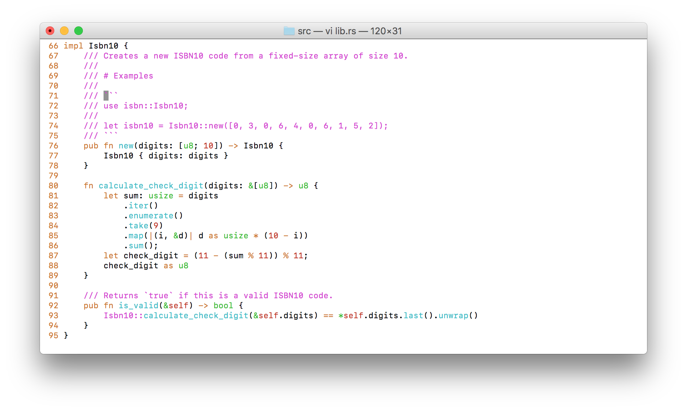
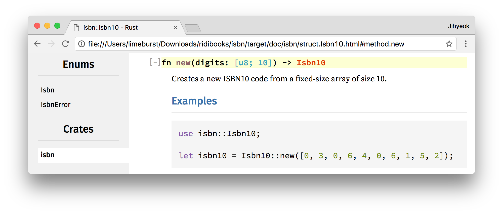
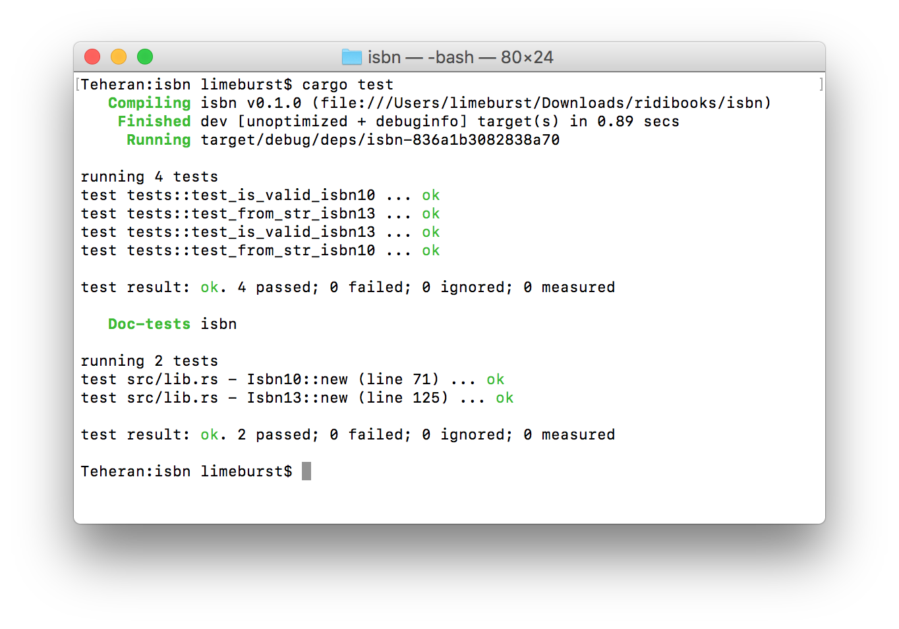

# 클린 코드 스터디 7주차 적용사례

## [doctest][]

> doctest is a module included in the Python programming language's standard library that allows the easy generation of tests based on output from the standard Python interpreter shell, cut and pasted into docstrings.

## [Rust][] [적용][Rust Doctest] [사례][limeburst/isbn]

이렇게 코드를 짜면:

멋진 문서가 생기고,

테스트도 됩니다!

[doctest]: https://en.wikipedia.org/wiki/Doctest
[Rust]: https://www.rust-lang.org/
[Rust Doctest]: https://doc.rust-lang.org/book/first-edition/documentation.html#documentation-as-tests
[limeburst/isbn]: https://gitlab.ridi.io/limeburst/isbn
